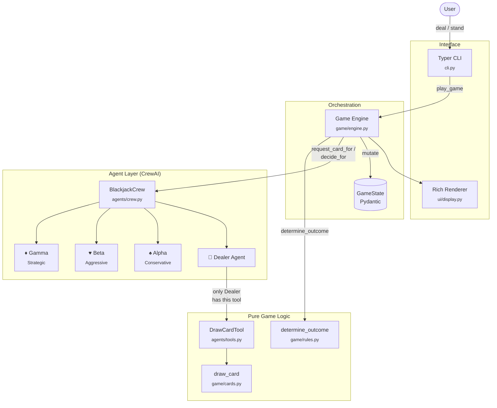

# Blackjack Crew

A simplified Blackjack game powered by a CrewAI agent crew, played from the terminal. The user plays against three AI agents with distinct decision-making personalities, coordinated through a dedicated Dealer Agent that holds the only access to the card-drawing function.

Built as a take-home assignment to demonstrate practical CrewAI usage, Python 3.12 idioms, and engineering taste in production-grade tooling (uv, Ruff, Mypy, Pytest, Rich, Typer, Pydantic).

---

## Table of contents

- [Quick start](#quick-start)
- [Architecture](#architecture)
- [Design decisions](#design-decisions)
- [Sample game](#sample-game)
- [Configuration](#configuration)
- [Testing](#testing)
- [Limitations and future work](#limitations-and-future-work)

---

## Quick start

### Prerequisites

- **Python 3.12+** (any 3.12.x patch release works)
- **[uv](https://docs.astral.sh/uv/)** — the modern Python package and project manager
- An **OpenAI API key** with credits ([platform.openai.com](https://platform.openai.com/api-keys))

### Setup

```powershell
# Clone the repository
git clone https://github.com/MKasirajan/blackjack-crew.git
cd blackjack-crew

# Install dependencies and the package itself (editable mode)
uv sync

# Configure your API key
cp .env.example .env
# Open .env in your editor and set OPENAI_API_KEY to your real key
```

### Run a game

```powershell
# Play a normal (non-deterministic) game
uv run blackjack-crew play

# Play a reproducible game with a seed
uv run blackjack-crew play --seed 42

# Show version
uv run blackjack-crew version

# Show help
uv run blackjack-crew --help
```

The first game costs approximately **$0.10–$0.30** in OpenAI API spend on `gpt-5.5`, depending on how many cards each agent draws. Subsequent games are similar.

---

## Architecture



### Module responsibilities

| Module | Responsibility | Knows about LLMs? |
|---|---|---|
| `game/cards.py` | Card-drawing primitive (2–11 integer) | No |
| `game/state.py` | Pydantic models for game state | No |
| `game/rules.py` | Pure-function rules (winner, tie, bust) | No |
| `game/engine.py` | Game loop orchestrator | Indirectly |
| `agents/personas.py` | Persona definitions (data, not code) | No |
| `agents/tools.py` | CrewAI tool wrapping `draw_card` | Yes |
| `agents/factory.py` | Assembles agents from personas + LLM | Yes |
| `agents/crew.py` | Crew assembly + per-turn task execution | Yes |
| `ui/display.py` | All terminal rendering (Rich) | No |
| `cli.py` | Typer CLI entry point | No |

The strict separation — game logic, agent logic, and rendering each in its own layer — makes each layer independently testable and replaceable. The game engine doesn't know LLMs exist; the agents don't know how the game is rendered; the UI doesn't know about CrewAI.

---

## Design decisions

### 1. CrewAI as the agent framework

The assignment brief uses the word *"Crew"* explicitly: *"a team (or 'Crew') of at least three AI agents."* CrewAI is built around exactly that metaphor — a `Crew` of `Agent` objects with distinct roles, goals, and tools — and so it matches the brief's vocabulary precisely. LangChain or LangGraph would have worked, but they would have required wrapping their abstractions to match the "crew" framing the brief invites.

### 2. Player-oriented agent topology (4 agents, not 3)

The brief specifies "at least three AI agents." I implemented four: a **Dealer Agent** that owns the card-drawing tool, plus **three Player Agents** (Alpha, Beta, Gamma) that play autonomously alongside the user. The alternative would have been service-oriented (Dealer + Advisor + Game Master), but the brief's example *"Ask Agent X to deal me a card"* and the requirement for agents to "simulate decision-making (e.g. whether to draw another card)" both imply player-side behaviour, not orchestration behaviour. Player-oriented topology also makes the demo qualitatively richer — three distinct personalities producing visibly different game outcomes.

### 3. Tool ownership enforces the brief's central constraint

The brief states: *"The user cannot call the card-drawing function directly. Instead, they must ask the AI crew to draw cards on their behalf."* I encode this in the architecture itself: only the Dealer Agent receives the `DrawCardTool` in its `tools=[...]` argument. Player Agents have `tools=[]`. They cannot call `draw_card` even if they wanted to — the framework will not present that tool to their LLM context. This makes the constraint a property of the system, not a behavioural convention.

### 4. Personas as natural language, not hard-coded rules

Each player's decision style (Alpha's conservative 15+ stand threshold, Beta's aggressive sub-18 push, Gamma's probabilistic reasoning) is encoded in the agent's `backstory` field — natural language read by the LLM on each turn. This is intentional. The alternative — hard-coding `if total >= 15: stand` — would not exercise CrewAI at all; it would just be Python with a thin LLM wrapper for window dressing. By keeping the decision logic in natural language, the agents' behaviour is genuinely LLM-driven and the personas can be tuned by editing prose, not refactoring code.

### 5. Pydantic for all game state

Cards, Hands, PlayerStates, GameStates, and GameOutcomes are all Pydantic models. The validation is real — `Card.value` is constrained to `[2, 11]` at the type level, `turn_order` is validated to contain each player exactly once, `Hand.add_card` raises if you exceed the 3-card limit. Pydantic also gives free serialisation, computed fields (`total`, `is_busted`, `cards_drawn`, `can_draw_more`), and editor-level type discipline. Plain `dataclass` would have worked but would have required hand-rolling each invariant.

### 6. `BaseTool` subclass instead of `@tool` decorator

This was a real debugging story worth telling. The initial implementation used CrewAI's `@tool` decorator. Tests passed, the smoke test passed, but the first end-to-end game produced an identical card value for every single draw — even with proper seeding. The root cause: CrewAI's `@tool` decorator includes result caching by default. For a stochastic tool with no arguments, every call looked identical to the cache, so the first draw's result was returned on every subsequent invocation.

The fix was to convert from `@tool` to a `BaseTool` subclass and explicitly set `cache_function = _never_cache`. The function form is shorter; the class form is correct. This is a common pattern in production LLM agent code — frameworks default to caching for safety, and stochastic tools must opt out explicitly.

### 7. Explicit tie handling

When multiple players have the same highest qualifying score, the game declares a tie rather than picking an arbitrary winner. The brief says *"the winner is the one with the highest total"* — when no single player has the highest total, "Tie at N between X and Y" is the honest answer. Tested explicitly in `tests/test_rules.py::test_tie_between_two_players`.

### 8. Structured CLI commands, not free-form natural language

The user interacts via `deal` / `stand` rather than typing free-form English like *"Hey Alpha, ask the Dealer to give me a card."* The brief's example *"Ask Agent X to deal me a card"* itself reads as a structured command pattern, not free-form English. Structured commands are 100% reliable; free-form routing via LLM is fragile, adds an extra LLM call per user message (doubling cost), and adds no engineering value. The right tool for flow control is a parser, not a language model.

### 9. Typer + Rich for the CLI and UX

Typer handles command parsing (subcommands, options, help text, validation) with minimal boilerplate. Rich handles colored output, panels, tables, and prompts. Together they replace what would otherwise be a tangle of `argparse` and ANSI escape sequences. Both are senior-engineer defaults in 2026 Python.

### 10. Test strategy: pure logic gets full coverage; LLM layers are mocked or excluded

The `game/` module — cards, state, rules — has 35 deterministic tests covering value ranges, validation, scoring, winner determination, tie handling, all-bust handling, and edge cases. The agent layer and engine are not covered by tests in this iteration because LLM-driven behaviour is non-deterministic and expensive to test against. In a longer-term codebase I would add a `@pytest.mark.live` integration test that runs against a real LLM, excluded from the default suite. For now, the smoke test at the end of Stage 9 (committed as `0cd666b`) verifies the agent layer integrates correctly with the LLM.

### 11. Defensive error handling around every LLM call

Every `crew.request_card_for(...)` and `crew.decide_for(...)` call in `engine.py` is wrapped in `try/except`. If the LLM returns an unparseable response, times out, or fails for any reason, the affected player is force-stood and the game continues. The alternative — crashing on a mid-game LLM failure — would be unacceptable for any deployed agent system.

### 12. Conventional Commits

Every commit follows the [Conventional Commits](https://www.conventionalcommits.org/) format: `feat(scope): subject` with bullet-pointed body. This is purely a discipline choice and signals automated changelog readiness, but in a small project like this it also serves to make the commit history readable as a development narrative.

---

## Sample game

A complete game with `--seed 7`. The user (you) drew 21; Gamma busted at 22; Alpha and Beta each stopped at moderate totals. Single clear winner outcome.

```
╭──────────────────────────────────────────────────────────────────╮
│                         Blackjack Crew                           │
│      You vs Alpha, Beta, and Gamma — highest total under 21      │
│                    Reproducible mode — seed: 7                   │
╰──────────────────────────────────────────────────────────────────╯

The Dealer is at the table.
Alpha (Conservative) takes a seat.
Beta (Aggressive) takes a seat.
Gamma (Strategic) takes a seat.

────────────────────────  Your turn  ────────────────────────
  You  •  Hand: (empty)  •  Total: 0  •  Cards: 0/3
What would you like to do?  [deal/stand] (deal): deal
You ask the Dealer for a card...
  The Dealer draws and reports: 2
  You  •  Hand: 2  •  Total: 2  •  Cards: 1/3
What would you like to do?  [deal/stand] (deal): deal
You ask the Dealer for a card...
  The Dealer draws and reports: 8
  You  •  Hand: 2, 8  •  Total: 10  •  Cards: 2/3
What would you like to do?  [deal/stand] (deal): deal
You ask the Dealer for a card...
  The Dealer draws and reports: 11
  You  •  Hand: 2, 8, 11  •  Total: 21  •  Cards: 3/3   21!

──────────────────────  Alpha's turn  ──────────────────────
  Alpha hits.
     "With a total of 0, I need to draw to build a playable hand."
  The Dealer draws and reports: 5
  Alpha hits.
     "At 5, the risk of busting is impossible and I need to improve."
  The Dealer draws and reports: 4
  Alpha hits.
     "With only 9, I can safely take one more card to improve my hand."
  The Dealer draws and reports: 11
  Alpha  •  Hand: 5, 4, 11  •  Total: 20  •  Cards: 3/3

──────────────────────  Beta's turn  ───────────────────────
  Beta hits.
     "I need cards on the table, and I always push for 18 or higher."
  The Dealer draws and reports: 6
  Beta hits.
     "I'm at 6, so I'm pushing hard for a much stronger total."
  The Dealer draws and reports: 7
  Beta hits.
     "I'm at 13, so I'll take the risk and push for a stronger total."
  The Dealer draws and reports: 4
  Beta  •  Hand: 6, 7, 4  •  Total: 17  •  Cards: 3/3

──────────────────────  Gamma's turn  ──────────────────────
  Gamma hits.
     "At 0, there is no bust risk and I need to build a competitive total."
  The Dealer draws and reports: 7
  Gamma hits.
     "At 7, there is no chance of busting, so drawing improves my position."
  The Dealer draws and reports: 6
  Gamma hits.
     "At 13, only about 30% of possible draws bust me, so hitting has worthwhile upside."
  The Dealer draws and reports: 9
  Gamma  •  Hand: 7, 6, 9  •  Total: 22  •  Cards: 3/3   BUSTED

────────────────────  Final Standings  ─────────────────────
┏━━━━━━━━┳━━━━━━━━━━━┳━━━━━━━┳━━━━━━━━┓
┃ Player ┃ Hand      ┃ Total ┃ Status ┃
┡━━━━━━━━╇━━━━━━━━━━━╇━━━━━━━╇━━━━━━━━┩
│ You    │ 2, 8, 11  │    21 │ Drew 3 │
│ Alpha  │ 5, 4, 11  │    20 │ Drew 3 │
│ Beta   │ 6, 7, 4   │    17 │ Drew 3 │
│ Gamma  │ 7, 6, 9   │    22 │ Busted │
└────────┴───────────┴───────┴────────┘

╭──────────────────────────────────────────────────────────────────╮
│  Winner: You with 21                                             │
╰──────────────────────────────────────────────────────────────────╯
```

Observations:

- **You hit 21** on the third card — the maximum possible non-busted total.
- **Alpha** (Conservative, "stands at 15+") drew her full three cards because her totals along the way (5, 9) never crossed the 15 threshold before her 3-card limit. She landed on 20.
- **Beta** (Aggressive, "hits until 18+") pushed through 6, 13, and 17 — never crossing his 18 threshold, so he kept hitting until the 3-card cap.
- **Gamma** (Strategic, probability-aware) reasoned about bust probability at each step ("At 13, only about 30% of possible draws bust me"), correctly identifying that the upside at 13 still justified hitting — and busted at 22 on the third card. A demonstration of calibrated risk-taking, not always winning.

The personas produce visibly distinct play even when the outcome is unfavourable to a particular agent.

---

## Configuration

Environment variables (set via `.env` in the project root):

| Variable | Required | Default | Purpose |
|---|---|---|---|
| `OPENAI_API_KEY` | Yes | — | Your OpenAI API key (starts with `sk-proj-...`) |
| `OPENAI_MODEL` | No | `gpt-5.5-2026-04-23` | OpenAI model identifier; can be swapped without code change |

The `OPENAI_MODEL` variable enables model abstraction without code changes — point it at a different OpenAI model (or compatible model via LiteLLM) by editing the `.env`. The default targets the current OpenAI reasoning-model family.

### Reasoning model considerations

`gpt-5.5` and similar reasoning models distinguish between **reasoning tokens** (internal chain-of-thought, hidden) and **completion tokens** (the visible response). Both count against `max_completion_tokens`. The agent factory sets a default of 2000 tokens per agent call — comfortably covering reasoning plus a short decision response. Older non-reasoning models (gpt-4o, gpt-3.5) would use the same parameter name but consume tokens differently.

---

## Testing

### Run the test suite

```powershell
uv run pytest -v
```

35 tests across three modules:

- `tests/test_cards.py` (7 tests) — card-drawing value range, seeded determinism, distribution
- `tests/test_state.py` (20 tests) — Card/Hand/PlayerState/GameState model validation and computed properties
- `tests/test_rules.py` (8 tests) — single winner, tie, all-bust, busted-player exclusion, summary messages

### Linting and type checking

```powershell
uv run ruff check .         # Lint (rules from pyproject.toml + ruff.toml)
uv run ruff format --check  # Format check
uv run mypy src             # Type check across 15 source files
```

All three are zero-tolerance — any warning fails the check. Production-grade code expectations.

### What is not tested

- **Agent layer (`agents/`)** — agent behaviour is LLM-driven, non-deterministic, and would require either mocking the LLM (substantial fixture surface) or running live calls (expensive, slow, flaky). An integration test marked `@pytest.mark.live` would be the right addition in a longer-term codebase.
- **CLI layer (`cli.py`)** — exercised manually via `blackjack-crew play`. The CLI surface is thin (two commands, two flags); Typer's own test framework would be the right tool if this surface grew.

---

## Limitations and future work

### Current limitations

1. **No multi-game sessions.** Each invocation plays one game and exits. A `--rounds N` option would be straightforward to add.
2. **No persistent state.** Game history is not stored. Adding a SQLite-backed game log would be a half-day's work.
3. **Single LLM provider.** Tested only against OpenAI's `gpt-5.5`. CrewAI/LiteLLM support other providers transparently via model strings (`claude-3-5-sonnet-...`, `gemini-pro`, etc.), but I have not validated those paths.
4. **Token budget tuned for reasoning models.** The default 2000 `max_completion_tokens` is generous for non-reasoning models and may be excessive for them (no cost benefit but wasted ceiling).
5. **Tie outcomes are declared, not broken.** I chose this deliberately (see Design Decisions §7), but some game variants might prefer a tiebreaker rule.
6. **Persona behaviour is LLM-interpreted, not strictly deterministic.** Alpha's "stand at 15" rule is encoded in prose; the LLM might occasionally interpret it differently at the margins. Acceptable for a demo; would need hardening for any production-stakes use.

### Natural extensions

- **Suits and face cards.** The `Card` model is intentionally over-engineered for a single-integer brief — adding suits and face cards would be a one-field addition.
- **Multi-round tournaments.** Running multiple games and tracking cumulative scores per player.
- **Per-agent LLM choice.** Different agents using different models — Dealer on a cheap fast model, Gamma on a reasoning model for actual probabilistic computation.
- **Observability.** CrewAI ships with OpenTelemetry instrumentation; surfacing agent decision traces would aid debugging.

---

## Repository structure

```
blackjack-crew/
├── .env.example                    # Configuration template
├── .gitignore
├── .python-version                 # Pinned Python version
├── pyproject.toml                  # Project config (deps, build, ruff, mypy, pytest)
├── uv.lock                         # Locked dependency graph
├── README.md                       # This file
└── src/
    └── blackjack_crew/
        ├── __init__.py
        ├── __main__.py             # Enables `python -m blackjack_crew`
        ├── cli.py                  # Typer CLI entry point
        ├── game/
        │   ├── cards.py            # Card-drawing primitive
        │   ├── state.py            # Pydantic game state models
        │   ├── rules.py            # Pure rule functions
        │   └── engine.py           # Game loop orchestrator
        ├── agents/
        │   ├── personas.py         # Persona data
        │   ├── tools.py            # DrawCardTool (BaseTool subclass)
        │   ├── factory.py          # Persona → Agent factory
        │   └── crew.py             # Crew assembly + task execution
        └── ui/
            └── display.py          # Rich-based terminal renderer
└── tests/
    ├── test_cards.py
    ├── test_state.py
    └── test_rules.py
```